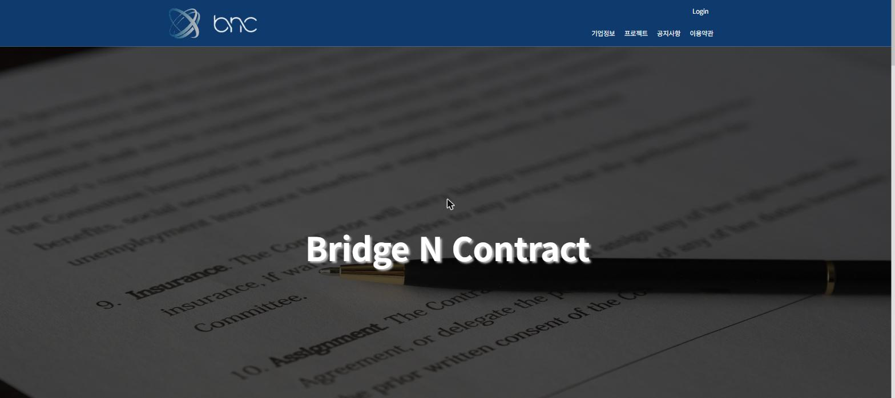
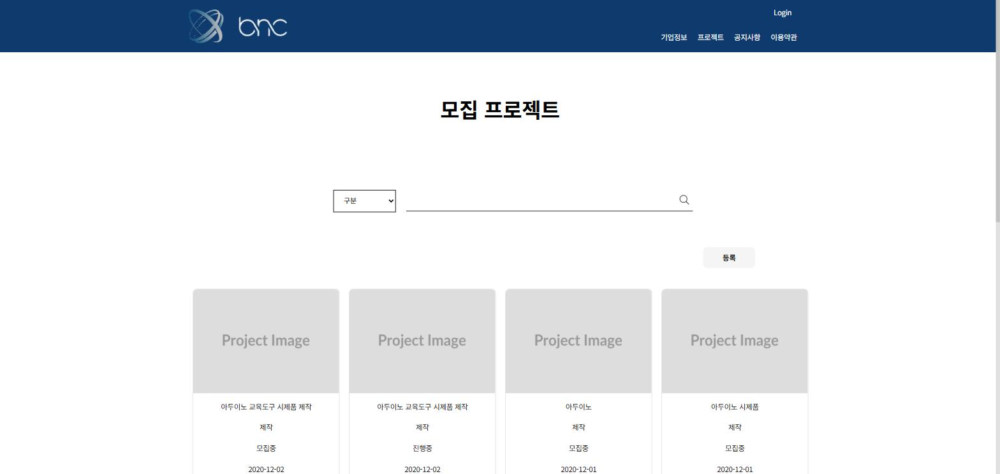
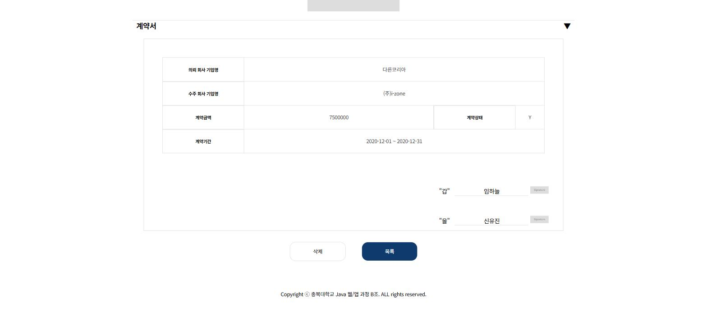
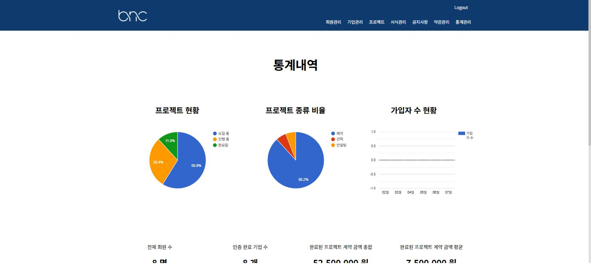
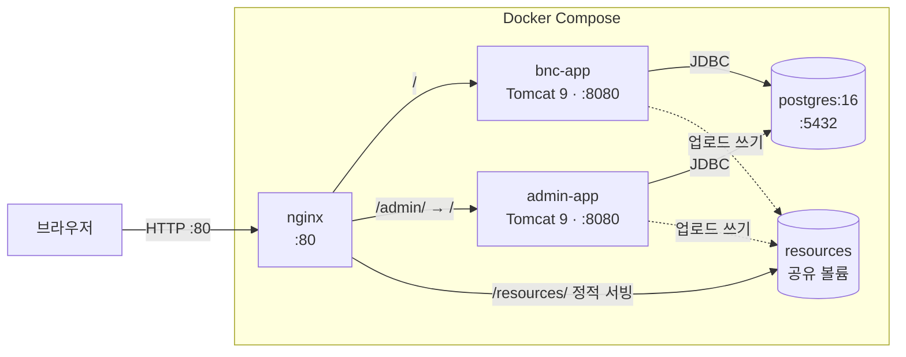

# BNC (Bridge N Contract)

스타트업–제조업체 기술 매칭 및 전자계약 플랫폼


---

## 이 리포지토리는 무엇인가

2020년 12월 훈련과정에서 팀으로 개발한 웹 애플리케이션이다. 이후 구동 불가 상태로 남아 있던 것을 2026년에 단독으로 분석해 현대 환경으로 이관하고 다시 돌아가게 만들었다.

원본 대비 변경의 골자는 세 가지다. **Oracle 11g → PostgreSQL 16 전환**, **Docker Compose + Nginx 컨테이너화**, **하드코딩 설정의 환경변수 외부화**(소셜 로그인은 키 미설정 상태에서도 동작하도록 조건부 비활성화 처리).

기능 자체는 원본을 유지했다. 비즈니스 로직은 건드리지 않고 실행 환경과 DB 방언만 옮기는 것을 원칙으로 삼았다.

---

## 빠른 실행

**사전 요구사항** — Docker, Docker Compose v2 (`docker compose` 명령)

```bash
git clone https://github.com/psh140/BNC.git
cd BNC
cp .env.example .env
# .env 편집: DB_USERNAME, DB_PASSWORD 입력
docker compose up -d --build
```

Java나 Maven을 로컬에 설치할 필요는 없다. 빌드는 컨테이너 안에서 처리된다.

### 필수 환경변수

| 변수 | 설명 |
|---|---|
| `DB_URL` | JDBC 접속 URL. `.env.example` 기본값(`jdbc:postgresql://postgres:5432/bnc`)을 그대로 쓰면 된다 |
| `DB_USERNAME` | DB 계정. postgres 컨테이너 생성에도 함께 쓰인다 |
| `DB_PASSWORD` | DB 비밀번호 |

### 선택 환경변수

비워두면 해당 기능만 꺼지고 나머지는 정상 동작한다.

| 변수 | 용도 | 비워둘 경우 |
|---|---|---|
| `FILE_ROOT_PATH` | 업로드 파일 저장 경로 | 코드 기본값 `/app/resources` 사용 |
| `FILE_DOWNLOAD_PATH` | 다운로드 기준 경로 | 코드 기본값 `/app` 사용 |
| `NAVER_CLIENT_ID` / `NAVER_CLIENT_SECRET` / `NAVER_REDIRECT_URI` | 네이버 로그인 | 로그인 화면에서 네이버 버튼이 숨겨진다 |
| `KAKAO_CLIENT_ID` / `KAKAO_REDIRECT_URI` | 카카오 로그인 | 로그인 화면에서 카카오 버튼이 숨겨진다 |
| `MAIL_USERNAME` / `MAIL_PASSWORD` | Gmail SMTP (앱 비밀번호) | 관리자의 회원 승인 메일이 발송되지 않는다 |

### 접속

| 대상 | URL | 계정 |
|---|---|---|
| 사용자 화면 | http://localhost/ | 소셜 로그인 (키 설정 시) |
| 관리자 화면 | http://localhost/admin/ | `admin` / `admin` |

Nginx가 앞단에서 경로로 두 앱을 나눠 보낸다. `:8080`·`:8081` 직접 접속도 열려 있지만 정상 경로가 아니다. 관리자 화면을 `:8081`로 직접 열면 JSP 링크의 `/admin/` 접두어 때문에 화면이 깨진다.

### DB 초기화

`sql/init.sql`이 최초 기동 시 자동 실행된다. 스키마와 시드 데이터(회원 8, 기업 8, 프로젝트 17, 관리자 1)가 함께 들어간다. 관리자 계정은 시드 데이터에 포함되어 있으므로 별도 생성이 필요 없다.

postgres 공식 이미지는 **데이터 볼륨이 비어 있을 때만** 초기화 스크립트를 실행한다. 스키마를 다시 올리려면 볼륨까지 지워야 한다.

```bash
docker compose down      # 중지 (DB 유지)
docker compose down -v   # 중지 + DB 볼륨 삭제 → 다음 기동 때 init.sql 재실행
```

> 앱 컨테이너만 개별 재생성한 경우 nginx도 함께 재시작해야 한다 (`docker compose restart nginx`). 이유는 [TROUBLESHOOTING.md](TROUBLESHOOTING.md) 참고.

---

## 화면

| 메인 | 모집 프로젝트 목록 |
|---|---|
|  |  |
| **전자계약 (관리자 화면)** | **관리자 통계** |
|  |  |

썸네일과 서명란의 이미지는 플레이스홀더다. 2020년에 업로드된 원본 파일은 저장소에 포함되어 있지 않다.

---

## 아키텍처



Nginx는 `/`를 사용자앱으로, `/admin/`은 접두어를 떼어내고 관리자앱으로 넘긴다. 응답의 `Location` 헤더에는 `proxy_redirect`가 접두어를 다시 붙여주므로, 관리자앱 내부 코드는 `/admin/`을 모른 채 작성돼 있다.

업로드 파일은 두 앱이 같은 볼륨에 쓰고 Nginx가 직접 서빙한다. 사용자앱이 올린 사업자등록증·CI 이미지를 관리자 화면에서 그대로 조회해야 하기 때문이다.

---

## 기술 스택

| 구분 | 원본 (2020) | 현재 (2026) |
|---|---|---|
| Language | Java 8 <sub>(PPT 표기 `Java 1.11`)</sub> | Java 8 |
| Framework | Spring Framework 5.2.0 <sub>(PPT 표기 `Spring 3.9.14`)</sub> | Spring Framework 5.2.0 |
| Persistence | MyBatis 3.4.6 / HikariCP 3.4.5 | 동일 |
| JDBC Driver | ojdbc6 11.2.0.3 + log4jdbc | PostgreSQL JDBC 42.7.3 |
| Database | Oracle 11g | PostgreSQL 16 |
| WAS | Tomcat 9.0 | Tomcat 9.0 (`tomcat:9.0-jdk8`) |
| Build | Maven | Maven 3.8 (Docker 멀티스테이지) |
| Infra | 로컬 Windows | Docker Compose + Nginx |
| Auth | 네이버 / 카카오 OAuth 2.0 | 동일 (키 미설정 시 조건부 비활성화) |

> PPT의 `Java 1.11`과 `Spring 3.9.14`는 실제 `pom.xml` 값과 다르다. 후자는 Spring Framework에 존재하지 않는 버전으로, STS의 Spring Legacy Project 템플릿 버전이 잘못 옮겨진 것으로 보인다. 위 표는 `pom.xml`을 기준으로 정정했다.

**앱별 전용 의존성** — 사용자앱: scribejava 2.8.1(OAuth) / 관리자앱: spring-context-support + javax.mail 1.5.6(승인 메일)

> 계약서 PDF는 서버가 아니라 브라우저에서 `html2pdf.js`로 만든다. `pom.xml`의 iText 의존성은 원본에 등록만 되어 있고 이를 import하는 코드는 없다.

---

## 레거시 재생 작업

### DB 마이그레이션 (Oracle 11g → PostgreSQL 16)

Oracle 전용 문법만 표준 SQL로 교체하고 비즈니스 로직은 그대로 뒀다. 매퍼 17개 중 12개를 수정했다.

| Oracle | PostgreSQL |
|---|---|
| `TO_CHAR(sysdate, 'YYYYMMDDHHmmss')` | `TO_CHAR(NOW(), 'YYYYMMDDHH24MISS')` |
| `seq.nextval` + `FROM DUAL` | `nextval('seq')` |
| `ROWNUM` 기반 페이징 | `ROW_NUMBER() OVER(ORDER BY ...)` |
| `DECODE(...)` / `NVL(...)` | `CASE WHEN` / `COALESCE` |
| `FROM DUAL CONNECT BY LEVEL` | `generate_series(...)` |
| `ROWNUM` TOP-N 래퍼 | `ORDER BY ... LIMIT n` |

빈 달을 0으로 채우는 월별 통계 쿼리가 가장 크게 바뀐 부분이다.

```sql
-- Oracle: DUAL + CONNECT BY LEVEL 로 월 목록 생성
FROM DUAL CONNECT BY LEVEL <= TO_DATE(#{curMonth},'YYYYMM') - TO_DATE(#{criteriaMonth},'YYYYMM') + 1

-- PostgreSQL: generate_series 로 대체
FROM generate_series(TO_DATE(#{criteriaMonth},'YYYYMM'),
                     TO_DATE(#{curMonth},'YYYYMM'),
                     INTERVAL '1 month') s
```

전환 과정에서 **원본에 있던 SQL 버그 5건**도 함께 고쳤다. 존재하지 않는 컬럼을 갱신하던 UPDATE, `WHERE` 절에 `SET` 항목이 섞여 있던 문법 오류, `<insert>` 태그로 선언된 UPDATE 문 등이다. 상세는 [MIGRATION.md](MIGRATION.md) 참고.

### 빌드·실행 환경 복구 및 컨테이너화

원본은 그대로는 빌드되지 않는 상태였다. `ojdbc6`가 Maven Central에 없어 `pom.xml`에 외부 리포지토리(`datanucleus.org`, HTTP)를 별도로 등록해 두었는데, 이 저장소에 의존하는 한 빌드 재현성이 없다. PostgreSQL JDBC로 교체하면서 리포지토리 설정을 통째로 걷어내 Maven Central만으로 빌드되게 했다.

컨테이너화는 멀티스테이지로 구성했다. `maven:3.8-openjdk-8`에서 war를 만들고 `tomcat:9.0-jdk8`에 `ROOT.war`로 배포한다. 로컬 Java 버전과 무관하게 빌드된다.

DB 접속정보·파일 경로·OAuth 키·SMTP 계정은 전부 환경변수로 뺐다. 원본에는 특정 개발 PC의 경로(`D:/project/resources`)와 훈련센터 DB 서버 주소가 코드에 박혀 있어 다른 환경에서는 동작할 수 없었다.

### 소셜 로그인 조건부 비활성화

네이버·카카오 키를 발급받지 않은 상태에서도 앱이 정상 동작해야 한다. 미완성 기능으로 남겨두는 대신, **설정 부재를 하나의 상태로 다루도록** 구현했다.

- `OAuthConfig.isNaverEnabled()` / `isKakaoEnabled()`가 필요한 환경변수가 모두 채워졌는지 검사한다. `null`·공백은 물론 `.env.example`을 그대로 복사했을 때 남는 `your_` 접두 예시값도 미설정으로 취급한다.
- 비활성 제공자는 인증 URL 자체를 만들지 않고, 로그인 화면에서 버튼이 숨겨지며, 콜백 URL로 직접 접근해도 로그인 화면으로 되돌린다.
- 제공자별로 독립이라 한쪽만 켤 수 있다. **코드 수정 없이** `.env` 값을 채우고 컨테이너를 재생성하면 활성화된다.

---

## 주요 기능

**사용자앱** — 소셜 로그인으로 가입하고(약관 동의 화면이 곧 가입 단계다) 마이페이지에서 사업자등록증·CI를 올려 기업정보를 등록한다. 관리자 승인을 받으면 프로젝트를 발주하거나 다른 기업의 프로젝트에 매칭을 신청할 수 있다. 매칭이 성사되면 발주사가 계약서를 작성하고, 수주사가 확인·서명하면 계약이 체결된다. 계약서는 PDF로 내려받을 수 있다.

계약서는 양측 서명 상태를 플래그로 관리한다. 발주사가 내용을 다시 쓰면 수주사 서명이 지워지고 미체결 상태로 되돌아간다.

**관리자앱** — 회원·기업정보 승인(승인 시 인증 메일 발송), 프로젝트 관리, 계약서 서식·이용약관·공지사항 관리, 통계 대시보드. 목록 화면은 검색과 페이징을 지원한다.

기획 배경·기대효과·경쟁 서비스 비교는 [원본 발표자료](docs/충북대학교_프로젝트_PPT_1.0.pptx)에 있다.

---

## 알려진 제약

- **소셜 로그인이 꺼져 있다.** 네이버·카카오 키를 발급받지 않았다. `.env`에 값을 채우고 `docker compose up -d --force-recreate bnc-app` 후 `docker compose restart nginx`를 실행하면 켜진다. 코드 수정은 필요 없다.
- **회원 승인 메일이 발송되지 않는다.** `MAIL_USERNAME` / `MAIL_PASSWORD`가 비어 있다. Gmail 앱 비밀번호를 발급받아 `.env`에 넣으면 동작한다. 그 외 관리자 기능은 정상이다.
- **관리자 비밀번호가 평문으로 저장·비교된다.** 원본 구현을 그대로 유지한 부분이다. 로컬 실행을 전제로 한 저장소라 손대지 않았으나, 실제 서비스라면 해싱이 선행되어야 한다.
- **파일 업로드는 트랜잭션 롤백 대상이 아니다.** `@Transactional`이 DB만 되돌리므로 INSERT 실패 시 디스크에 파일만 남는다. 원본 구조를 유지했다.
- **시드 데이터의 업로드 파일이 없어 이미지가 깨져 보인다.** `sql/init.sql`에는 파일 경로만 들어 있고 2020년에 업로드된 실제 이미지는 저장소에 포함하지 않았다. 화면을 채워서 보려면 시드 데이터가 참조하는 경로에 임의의 이미지를 넣으면 된다.

  ```bash
  # 참조 경로 목록 확인
  docker compose exec postgres psql -U "$DB_USERNAME" -d bnc -t -A \
    -c "SELECT proj_thumb_file_path FROM bnc_project WHERE proj_thumb_file_path LIKE '/resources/%'"
  ```
- **사용자앱의 상세 화면은 로그인이 필요하다.** 프로젝트 상세·매칭·계약 화면은 회원 세션과 승인된 기업정보를 요구하므로, 소셜 로그인 키가 없으면 접근할 수 없다. 같은 데이터는 관리자 화면(`/admin/project/view`)에서 계약 내용까지 확인할 수 있다.

---

## 원본 프로젝트 정보

충북대학교 공동훈련센터 **Java 기반 웹/앱 개발자 양성 과정**의 팀 프로젝트로, 2020년 12월 2일에 발표했다.

| 구분 | 원본 팀 프로젝트 (2020) | 단독 재생 작업 (2026) |
|---|---|---|
| 기간 | ~ 2020.12.02 발표 <!-- TODO: 착수일 확인 필요 --> | 2026.05.25 ~ 2026.07.30 |
| 인원 | 4인 | 1인 |
| 역할 | 팀 총괄, 백엔드 주력 | 전 범위 |
| 작업 내용 | 기획, DB 설계, 기능 구현, 화면 개발 | 환경 분석, DB 마이그레이션, 빌드 복구, 컨테이너화, 버그 수정, 문서화 |

발표 자료: [docs/충북대학교_프로젝트_PPT_1.0.pptx](docs/충북대학교_프로젝트_PPT_1.0.pptx)

---

## 문서

| 문서 | 내용 |
|---|---|
| [MIGRATION.md](MIGRATION.md) | Oracle → PostgreSQL 변환 상세, 빌드 환경 복구 과정 |
| [TROUBLESHOOTING.md](TROUBLESHOOTING.md) | 전환 중 겪은 장애와 원인 분석 |
| [TODO.md](TODO.md) | 작업 진행 기록 |
